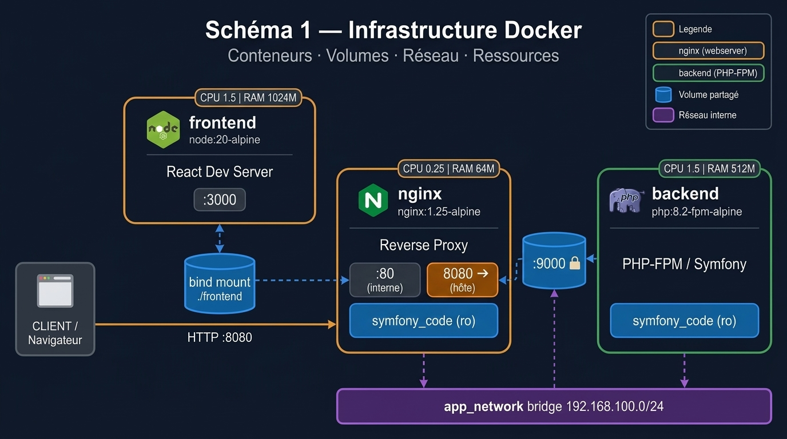
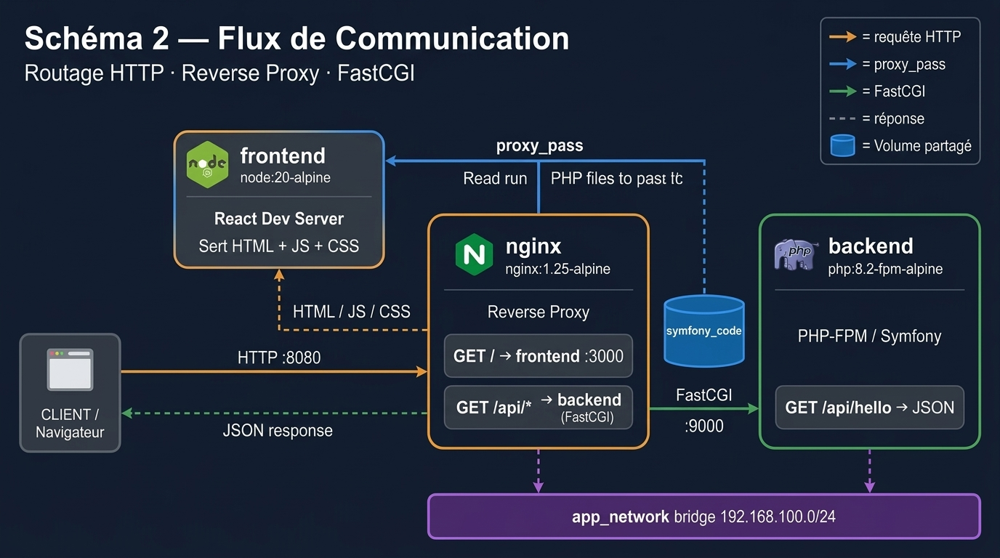

# TP Docker – Gestion d'une Entreprise de Soutien Scolaire (Study-Up)

**Auteur** : Julio Tepixtle  

> Plateforme de gestion d'une entreprise de soutien scolaire : planning des cours, paiements/abonnements, espaces Admin / Professeur / Parent.

---

## Schémas de l'architecture

### Schéma 1 — Infrastructure Docker
> Conteneurs, volumes, réseau, allocations de ressources



---

### Schéma 2 — Flux de Communication
> Routage des requêtes, Hot Reload, FastCGI, base de données



---

## Structure du projet

```
TP1/
├── docker-compose.yml
├── architecture.jpg
├── README.md
├── frontend/
│   ├── Dockerfile
│   ├── .dockerignore
│   ├── package.json
│   ├── public/index.html
│   └── src/ (App.js, index.js)
├── backend/
│   ├── Dockerfile
│   ├── .dockerignore
│   ├── .env
│   ├── composer.json
│   ├── public/index.php
│   └── src/Controller/HelloController.php
└── ngnix/
    ├── Dockerfile
    ├── nginx.conf
    └── default.conf
```

---

## 1. Image Frontend – React (`frontend/Dockerfile`)

### Image de base : `node:20-alpine`

Utilisation d'un **build multi-stage** :

| Stage | Image | Rôle |
|---|---|---|
| `builder` | `node:20-alpine` | Compile le code React (`npm run build`) |
| `runner` | `nginx:1.25-alpine` | Sert les fichiers statiques produits |

Le stage final ne contient **pas Node.js** → image finale ≈ 40 Mo au lieu de ~1 Go.

### Dépendances installées

| Dépendance | Raison |
|---|---|
| `node:20-alpine` | Runtime Node.js LTS pour `npm install` et `npm run build` |
| `react`, `react-dom` | Librairie frontend |
| `react-scripts` | Outil de build et bundler (Webpack) fourni par Create React App |

### Manipulation OS

- `RUN rm -f /etc/nginx/conf.d/default.conf` : suppression de la config Nginx par défaut pour imposer la nôtre.
- `RUN echo '...' > /etc/nginx/conf.d/react.conf` : injection d'une config Nginx minimale avec `try_files` pour le routing SPA.

### Port exposé

| Port | Protocole | Raison |
|---|---|---|
| `80` | HTTP | Port standard Nginx pour servir les fichiers React |

### Entrypoint

```dockerfile
CMD ["nginx", "-g", "daemon off;"]
```

`daemon off;` est obligatoire dans Docker : si Nginx se met en arrière-plan, le PID 1 se termine et Docker arrête le conteneur.

### SIGTERM

```dockerfile
STOPSIGNAL SIGTERM
```

Nginx gère SIGTERM nativement : il termine proprement les connexions en cours avant de s'arrêter.

---

## 2. Image Backend – Symfony (`backend/Dockerfile`)

### Image de base : `php:8.2-fpm-alpine`

| Choix | Raison |
|---|---|
| `php:8.2` | Version stable LTS requise par Symfony 7 |
| `fpm` | PHP-FPM (FastCGI Process Manager) : gère les workers PHP persistants, architecture standard avec Nginx |
| `alpine` | Image minimale (~20 Mo), réduit la surface d'attaque |

### Dépendances système (`apk add --no-cache`)

| Paquet | Raison |
|---|---|
| `git` | Requis par Composer pour résoudre des dépendances VCS |
| `unzip` | Composer décompresse les archives ZIP des packages |
| `curl` | Téléchargement de l'installateur Composer |
| `icu-dev` | Bibliothèque ICU → compile l'extension PHP `intl` |
| `libzip-dev` | Bibliothèque ZIP → compile l'extension PHP `zip` |
| `linux-headers` | Headers kernel requis pour compiler certaines extensions C |

### Extensions PHP (`docker-php-ext-install`)

| Extension | Raison |
|---|---|
| `intl` | Internationalisation (dates, monnaies, traductions) – requis par Symfony |
| `zip` | Gestion des archives ZIP (Composer, assets) |
| `opcache` | Cache de bytecode PHP → améliore les performances de 2 à 5× |
| `pdo` | Couche d'abstraction base de données |

### Manipulation OS

- **Création utilisateur non-root** `symfony` (UID 1000) : exécuter PHP-FPM en root est une mauvaise pratique de sécurité.
- **OPcache** configuré via `/usr/local/etc/php/conf.d/opcache.ini` : `validate_timestamps=0` en production (pas de rechargement automatique des fichiers PHP, performances maximales).
- **Composer** installé via son installateur officiel dans `/usr/local/bin/composer`.
- `composer install --no-dev --optimize-autoloader` : installation sans dépendances de dev, autoloader optimisé (classmap).
- `mkdir -p var/cache var/log && chown -R symfony:symfony var/` : Symfony doit pouvoir écrire dans `var/`.

### Port exposé

| Port | Protocole | Raison |
|---|---|---|
| `9000` | TCP (FastCGI) | Port par défaut de PHP-FPM – accessible uniquement en interne via `app_network` |

### Entrypoint

```dockerfile
CMD ["php-fpm"]
```

Lance PHP-FPM en foreground. PHP-FPM maintient un pool de processus PHP en attente de requêtes FastCGI provenant de Nginx.

### SIGTERM

```dockerfile
STOPSIGNAL SIGTERM
```

PHP-FPM gère SIGTERM (graceful stop) : il attend la fin du traitement des requêtes en cours avant de s'arrêter, sans couper de connexions brutalement.

---

## 3. Image Nginx – Serveur Web (`ngnix/Dockerfile`)

### Image de base : `nginx:1.25-alpine`

| Choix | Raison |
|---|---|
| `nginx:1.25` | Version stable mainline, supporte HTTP/2 |
| `alpine` | ≈ 40 Mo vs 190 Mo pour la version Debian |

### Dépendances installées

| Paquet | Raison |
|---|---|
| `curl` | Utilisé par le `HEALTHCHECK` Docker pour vérifier que Nginx répond |

### Manipulation OS

- **Remplacement de la config** : suppression de `nginx.conf` et `default.conf` par défaut, remplacés par nos fichiers custom.
- **Utilisateur `webuser`** (UID 1001) : les workers Nginx tournent sans privilège root.
- **`nginx.conf`** : configure les workers (`auto`), la compression gzip, le format de logs.
- **`default.conf`** : configure le reverse proxy :
  - `GET /` → fichiers statiques React
  - `GET /api/*` → forwarding FastCGI vers `backend:9000`

### Port exposé

| Port | Raison |
|---|---|
| `80` | Point d'entrée HTTP unique du système, mappé sur `8080` côté hôte |

### Entrypoint

```dockerfile
CMD ["nginx", "-g", "daemon off;"]
```

Même raison que pour le frontend : Nginx doit rester en foreground pour que le conteneur reste actif.

### Health Check

```dockerfile
HEALTHCHECK --interval=30s --timeout=10s --retries=3 --start-period=5s \
    CMD curl -f http://localhost/ || exit 1
```

Docker vérifie toutes les 30s que Nginx répond. Après 3 échecs → conteneur marqué `unhealthy`.

### SIGTERM

```dockerfile
STOPSIGNAL SIGTERM
```

Nginx effectue un arrêt gracieux sur SIGTERM.

---

## 4. Docker Compose – Orchestration

### Arguments au run – Ressources allouées

| Service | CPU limit | RAM limit | CPU réservé | RAM réservée | Justification |
|---|---|---|---|---|---|
| `frontend` | 0.5 cœur | 512 Mo | 0.25 cœur | 256 Mo | Build npm gourmand en mémoire |
| `backend` | 1.0 cœur | 256 Mo | 0.5 cœur | 128 Mo | PHP-FPM multi-workers |
| `nginx` | 0.25 cœur | 64 Mo | 0.1 cœur | 32 Mo | Event-driven, très léger |

### Variables d'environnement (arguments au run)

**Frontend :**

| Variable | Valeur | Raison |
|---|---|---|
| `NODE_ENV` | `production` | Active le build React optimisé (minification, tree-shaking) |
| `CI` | `false` | Empêche les warnings de faire échouer le build |

**Backend :**

| Variable | Valeur | Raison |
|---|---|---|
| `APP_ENV` | `prod` | Symfony désactive le debug, active l'optimisation |
| `APP_SECRET` | `change_me_...` | Clé secrète pour CSRF et sessions |
| `PHP_FPM_MAX_CHILDREN` | `10` | Nombre max de workers PHP parallèles |
| `PHP_MEMORY_LIMIT` | `128M` | Limite mémoire par processus PHP |

**Nginx :**

| Variable | Valeur | Raison |
|---|---|---|
| `NGINX_WORKER_PROCESSES` | `auto` | Un worker par CPU disponible |
| `NGINX_WORKER_CONNECTIONS` | `1024` | Connexions simultanées max par worker |

### Gestion des SIGTERM

Chaque service déclare :

```yaml
stop_signal: SIGTERM
stop_grace_period: 30s   # backend (PHP-FPM attend la fin des requêtes)
stop_grace_period: 10s   # nginx, frontend
```

`stop_grace_period` : Docker attend ce délai avant d'envoyer SIGKILL si le processus ne s'est pas arrêté. Cela permet un **arrêt gracieux** (aucune requête coupée brutalement).

### Ordre de démarrage (dépendances entre conteneurs)

```yaml
depends_on:
  backend:
    condition: service_healthy       # Nginx attend que PHP-FPM soit prêt (healthcheck)
  frontend:
    condition: service_completed_successfully  # Nginx attend que le build React soit terminé
```

Ordre garanti : `frontend` (build) → `backend` (healthcheck OK) → `nginx` (démarrage)

### Volumes partagés

| Volume | Services | Mode |
|---|---|---|
| `react_build` | `frontend` (écriture) → `nginx` (lecture) | Partage les fichiers React buildés |
| `symfony_code` | `backend` (écriture) → `nginx` (lecture) | Partage le code PHP pour FastCGI |

### Réseau interne

```yaml
networks:
  app_network:
    driver: bridge
    ipam:
      config:
        - subnet: 172.20.0.0/16
```

Réseau bridge dédié : les services se joignent par leur **nom de service** (`backend:9000`) et sont isolés du reste des conteneurs Docker de la machine hôte.

---

## Lancement

```bash
# Build et démarrage
docker compose up --build -d

# Accès
# Frontend React : http://localhost:8080/
# API Symfony   : http://localhost:8080/api/hello

# Logs
docker compose logs -f

# Arrêt propre (SIGTERM envoyé à chaque service)
docker compose down
```
